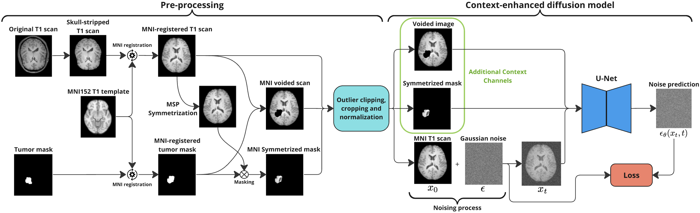
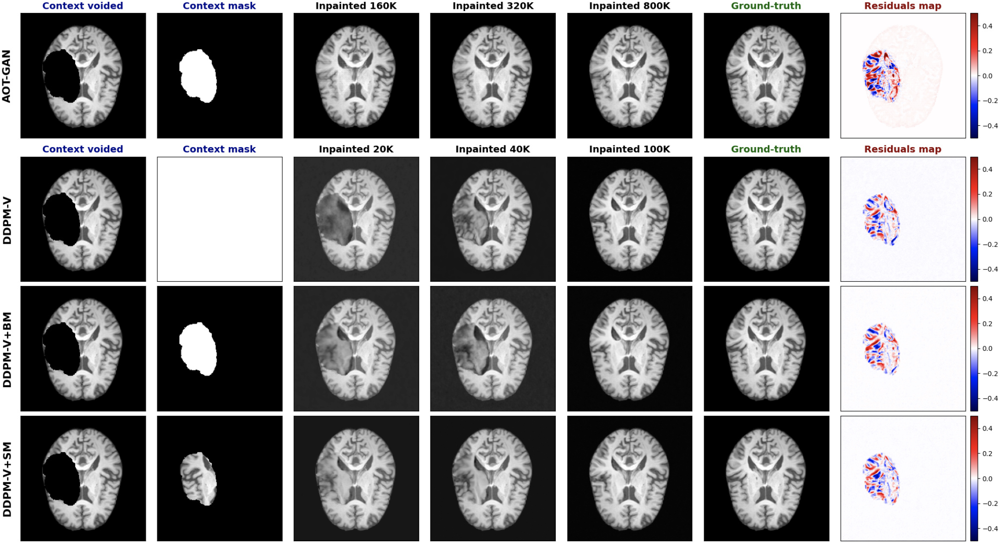
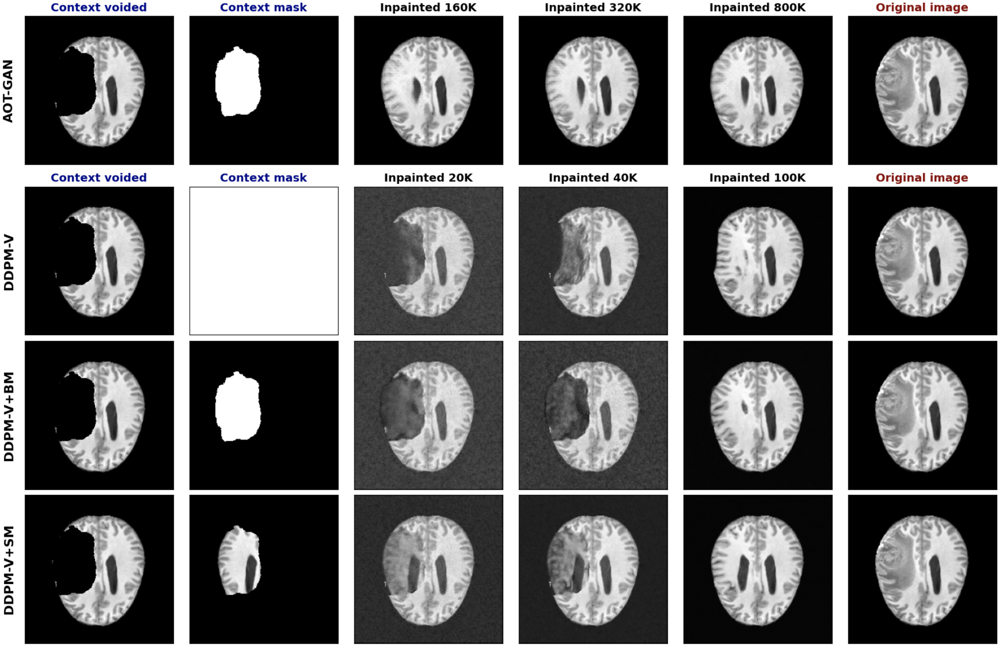

# Symmetry-Aware Brain MRI Inpainting Using Denoising Diffusion Models
This repository provides the official implementation for the paper **"Symmetry-Aware Brain MRI Inpainting Using Denoising Diffusion Models"**, presented at the **6th International Conference on Medical Imaging and Computer-Aided Diagnosis (MICAD 2025)**. The authors are Alejandro Santorum, Alberto Suárez, and Bahram Jafrasteh.

- Alejandro Santorum (alejandro.santorum@estudiante.uam.es or alejandro.santorum@gmail.com): Universidad Autónoma de Madrid, 28049, Madrid, Spain.
- Alberto Suárez: Universidad Autónoma de Madrid, 28049, Madrid, Spain.
- Bahram Jafrasteh: Department of Radiology, Weill Cornell Medicine, New York, NY, USA.

## Introduction
Image inpainting is an essential tool for restoring missing or corrupted regions in brain MRI scans, especially for tumor-affected brains, where methods designed for healthy anatomy can fail. This study introduces a novel symmetry-aware generative inpainting framework based on denoising diffusion probabilistic models (DDPMs) that leverages the pseudo-symmetry of the brain to enhance reconstruction quality and training efficiency. By leveraging the pseudo-symmetry of the human brain, aligning MRI data to the MNI space and incorporating mirrored symmetric contextual information as additional inputs, our approach enhances reconstruction quality and generalization across datasets. Experimental results demonstrate that our method outperforms baseline models, achieving superior fidelity with fewer training iterations. These findings highlight the potential of symmetry-aware inpainting to improve brain MRI reconstruction in clinical applications.

## Method
The figure below shows the proposed method exploiting brain pseudo-symmetry as an extra input channel for our enhanced denoising diffusion model. On the left-hand side, the different datasets are pre-processed to identify the mid-sagittal plane (MSP) and to ensure compatibility for use in an unified experimental framework. This is achieved by pre-processing the available data into the Montreal Neurological Institute (MNI) standard coordinate system.

To ensure consistency and improve the generalization of brain inpainting, intensity outliers are mitigated by clipping values beyond the 0.1 and 99.9 percentiles, and the final images are cropped and padded to obtain a standardized image size of 224 x 224 x 224.

The right-hand side of figure below illustrates the training process of the proposed context-enhanced diffusion model. The input consists of three image channels: the first context channel is the voided image, which masks the region to be inpainted, while the second is the symmetrized mask, representing the tissue from the symmetrical part of the brain relative to the MSP reflected in the other side of brain. The third channel is the T1 scan, which is corrupted with Gaussian noise and then denoised by the trained U-Net.

<!---

-->

## Quantitative Results
After training, the models are evaluated to assess their performance, consistency, and generalization.
Overall, the proposed DDPM-V+SM achieves the best performance across all evaluated metrics as reported in the table below, which contains the performance metrics of GAN/DDPMs trained for 800K/100K iterations.

| Model name | MSE↓ | SNR↑ | PSNR↑ | SSIM↑ |
|------------|------|------|-------|-------|
| **Performance on the test set of the IXI dataset** |||||
| **AOT-GAN** [Zeng et al., 2022] | 0.0212 ± 0.0132 | 12.97 ± 3.83 | 16.99 ± 3.01 | 0.664 ± 0.108 |
| **DDPM-V** | 0.0079 ± 0.0047 | 19.48 ± 3.35 | 21.47 ± 2.99 | 0.725 ± 0.110 |
| **DDPM-V+BM** [Durrer et al., 2024] | 0.0075 ± 0.0044 | 19.70 ± 3.33 | 21.68 ± 2.98 | 0.732 ± 0.109 |
| **DDPM-V+SM (This work)** | **0.0072** ± 0.0043 | **19.89** ± 3.33 | **21.87** ± 2.98 | **0.734** ± 0.109 |
| **Performance on the test set of the OpenNeuro 228 dataset** |||||
| **AOT-GAN** [Zeng et al., 2022] | 0.0156 ± 0.0086 | 14.32 ± 3.59 | 18.20 ± 2.84 | 0.705 ± 0.103 |
| **DDPM-V** | 0.0059 ± 0.0032 | 20.79 ± 3.14 | 22.65 ± 2.85 | 0.751 ± 0.110 |
| **DDPM-V+BM** [Durrer et al., 2024] | 0.0059 ± 0.0032 | 20.78 ± 3.14 | 22.64 ± 2.84 | 0.754 ± 0.109 |
| **DDPM-V+SM (This work)** | **0.0053** ± 0.0028 | **21.29** ± 3.16 | **23.15** ± 2.88 | **0.767** ± 0.105 |

## Qualitative Results
The following figure illustrates the reconstruction results on a dataset of healthy brain samples at different training steps for masked regions using the four considered models. The voided image (first column) and its corresponding mask (second column) serve as inputs, while the subsequent columns display reconstructions at 20K, 40K, and 100K training steps (x8 for the GAN). The final two columns show the ground-truth image and the difference between the 100K-step reconstruction and the ground- truth. The proposed model, which incorporates symmetric brain context, consistently achieves more accurate reconstructions at earlier training stages than other diffusion-based approaches. While all models eventually converge to realistic inpainting results, this method benefits from faster convergence due to its use of anatomical symmetry. By leveraging structural symmetry, the proposed approach more effectively aligns ventricle features and intensities across hemispheres, resulting in improved reconstruction accuracy.

<!---

-->

The figure below presents a reconstructed brain slice affected by a tumor. Notably, DDPM-V+SM, which integrates a symmetric mask containing explicit information from the contralateral hemisphere, achieves superior reconstruction of the ventricle region compared to other models, whose results display less distinct anatomical details. These findings indicate that incorporating symmetric context enables more accurate restoration of complex brain structures. Furthermore, the proposed symmetry-aware diffusion model more precisely recovers the brain contour than the other generative approaches.

<!---

-->

## Main References
- Ho, J., Ajay, J., Abbeel, P.: Denoising Diffusion Probabilistic Models. In: Advances in Neural Information Processing Systems. vol. 33, pp. 6840–6851 (2020).

- Nichol, A., Dhariwal, P.: Improved Denoising Diffusion Probabilistic Models. In:
International Conference on Machine Learning. pp. 8162–8171 (2021).

- Zeng, Y., Fu, J., Chao, H., Guo, B.: Aggregated Contextual Transformations for
High-Resolution Image Inpainting. IEEE Trans. Vis. Comput. Graph. (2022).

- Durrer, A., Wolleb, J., Cattin, P.C.: Denoising Diffusion Models for Inpainting of Healthy Brain Tissue. In: Brain Tumor Segmentation, and Cross-Modality Domain Adaptation for Medical Image Segmentation, pp. 35–45. Springer (2024).

- Durrer, A., Wolleb, J., Bieder, F., Friedrich, P., Melie-Garcia, L., Pineda, M.A.O., Bercea, C.I., et al.: Denoising Diffusion Models for 3D Healthy Brain Tissue In- painting. In: Deep Generative Models. Springer (2025).

